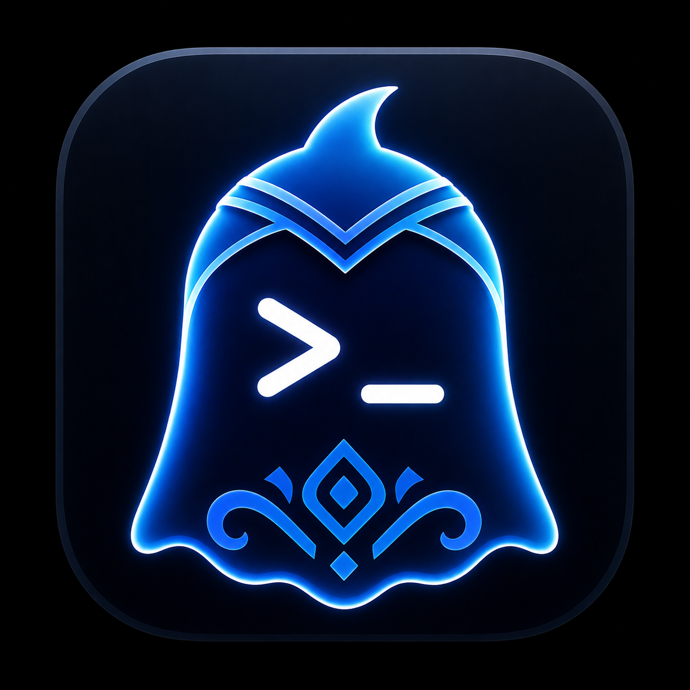
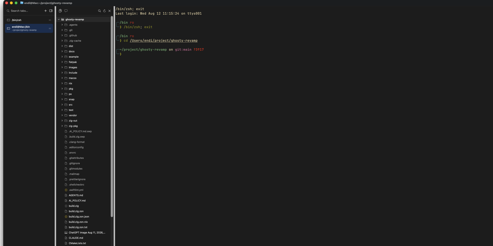
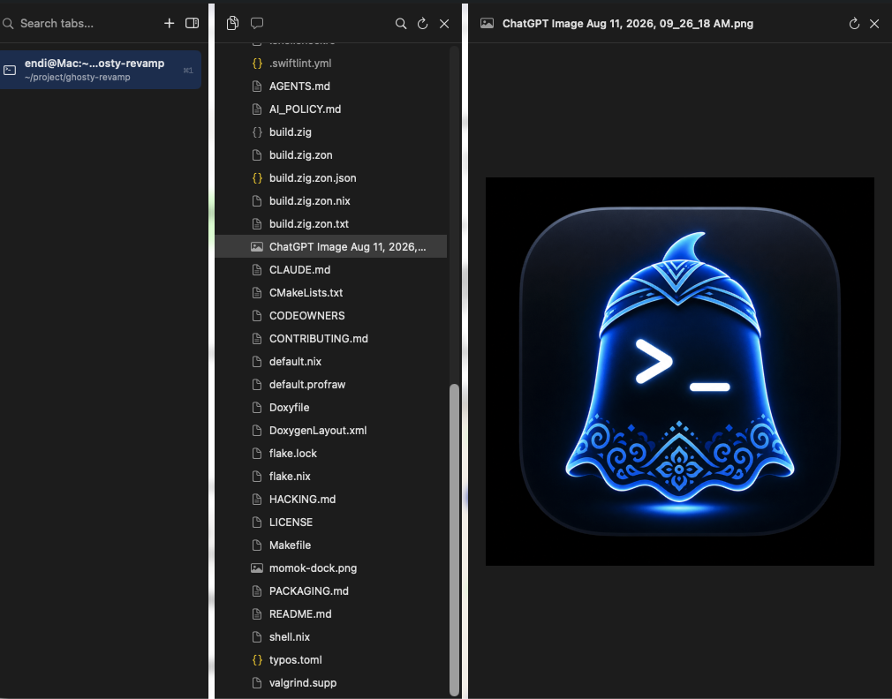

<h1 align="center">
  
  <br>Momok
</h1>

<p align="center">
  Terminal workspace native untuk macOS dengan vertical tabs, project explorer,
  preview file, dan workflow Neovim terintegrasi.
</p>

> [!IMPORTANT]
>
> Momok adalah proyek eksperimen dan fork independen dari
> [Ghostty](https://github.com/ghostty-org/ghostty). Momok terinspirasi oleh
> workflow modern [Warp Terminal](https://www.warp.dev/), tetapi dibangun di
> atas core native Ghostty untuk mempertahankan rendering Metal, startup yang
> cepat, dan performa terminal yang ringan. Momok tidak berafiliasi dengan atau
> didukung secara resmi oleh Ghostty maupun Warp.

## Tentang Momok

Momok menggabungkan terminal native berperforma tinggi dengan workspace yang
lebih praktis untuk coding. Fokus eksperimen ini adalah menghadirkan pengalaman
kerja modern seperti navigasi project dan preview terintegrasi tanpa mengganti
terminal dengan UI berbasis web atau runtime yang lebih berat.

Core terminal tetap menggunakan Zig, `libghostty`, dan renderer Metal dari
Ghostty. Fitur workspace macOS dikembangkan secara native dengan AppKit dan
SwiftUI.

## Tampilan

### Workspace native

Vertical tabs dan project explorer berada langsung di jendela terminal. Root
project mengikuti working directory terminal aktif.



### Preview file terintegrasi

File Markdown dan gambar dapat dibuka langsung dari project explorer tanpa
meninggalkan terminal. Panel preview dapat di-resize, di-refresh, atau ditutup.



Perubahan Momok dibandingkan aplikasi upstream terlihat terutama pada lapisan
workspace berikut:

| Area | Perubahan di Momok |
| --- | --- |
| Navigasi | Vertical tab sidebar dan project explorer terintegrasi |
| Editing | Reusable Neovim split dengan RPC dan editor tabs |
| Preview | Renderer Markdown dan image preview native |
| Tampilan | Branding Momok, ikon Dock, dan true-color CLI |

## Fitur

- Horizontal tabs bawaan atau vertical tab sidebar yang dapat diubah lebarnya.
- Vertical sidebar dan project explorer langsung aktif pada instalasi baru.
- Project explorer mengikuti working directory terminal aktif.
- Lazy directory loading, pencarian file, refresh, Reveal in Finder, dan Copy
  Path.
- Satu Neovim split di sisi kanan yang digunakan kembali saat membuka file.
- Integrasi Neovim RPC untuk membuka file berikutnya sebagai editor tab.
- Editor tabline dengan label tipe file, indikator perubahan, perpindahan tab,
  dan tombol tutup.
- Preview Markdown native dengan heading, list, quote, code block, table, dan
  inline formatting.
- Preview gambar native untuk format yang didukung macOS, termasuk PNG, JPEG,
  GIF, TIFF, HEIC, BMP, dan WebP yang tersedia pada versi macOS pengguna.
- Panel preview yang dapat di-resize, di-refresh, dan ditutup.
- Dukungan true color untuk aplikasi terminal seperti Codex.
- Branding, bundle identifier, menu, nama aplikasi, dan ikon Dock Momok.

## Instalasi di macOS

### Cara termudah

Tidak perlu Xcode, Zig, Homebrew, atau proses build. Buka aplikasi Terminal,
salin perintah berikut, lalu tekan Enter:

```shell
/bin/bash -c "$(curl -fsSL https://raw.githubusercontent.com/andiahmads/Momok/main/install.sh)"
```

Installer akan mengunduh aplikasi universal terbaru, memasangnya ke Applications,
dan membuka Momok secara otomatis. Perintah yang sama juga digunakan untuk
update.

> [!NOTE]
>
> Binary GitHub Release memakai ad-hoc signature tetapi belum dinotariskan oleh
> Apple. Installer menghapus atribut quarantine dari aplikasi yang baru
> diunduh. Distribusi notarized akan memerlukan akun Apple Developer.

### Instalasi manual untuk developer

Persyaratan: macOS, Xcode 26 dengan macOS 26 SDK, Zig 0.16.0 atau lebih baru,
dan Git. Neovim bersifat opsional.

```shell
git clone https://github.com/andiahmads/Momok.git
cd Momok
zig build -Doptimize=ReleaseFast
```

Bundle aplikasi akan dibuat di `macos/build/ReleaseLocal/Momok.app`. Tutup
Momok versi lama, lalu install ke folder Applications:

```shell
pkill -f '/Applications/Momok.app/Contents/MacOS/ghostty' 2>/dev/null || true
ditto macos/build/ReleaseLocal/Momok.app /Applications/Momok.app
open /Applications/Momok.app
```

Jika ikon Dock belum berubah setelah update, jalankan:

```shell
killall Dock
open /Applications/Momok.app
```

### Update manual

```shell
cd Momok
git pull
zig build -Doptimize=ReleaseFast
pkill -f '/Applications/Momok.app/Contents/MacOS/ghostty' 2>/dev/null || true
ditto macos/build/ReleaseLocal/Momok.app /Applications/Momok.app
open /Applications/Momok.app
```

## Konfigurasi

Momok masih kompatibel dengan konfigurasi core Ghostty. Konfigurasi terminal
yang sudah ada di `~/.config/ghostty/config` tetap dapat digunakan, termasuk
font, theme, key binding, shell integration, dan pengaturan terminal lainnya.

Vertical sidebar dan project explorer aktif secara default. Pengguna yang lebih
menyukai tab horizontal dapat memilihnya secara eksplisit:

```ini
macos-tab-style = native
```

Jika Neovim tidak tersedia, Momok menggunakan Vim bawaan macOS sebagai editor
split sederhana. Integrasi RPC, custom tabline, dan reusable editor tabs hanya
tersedia dengan Neovim. Jika Neovim maupun Vim tidak ditemukan, Momok
menampilkan dialog untuk membuka file memakai aplikasi default macOS.

Untuk mengaktifkan editor split dengan seluruh fitur, install Neovim dengan:

```shell
brew install neovim
```

Untuk menjaga warna aplikasi CLI seperti Codex, jangan menetapkan environment
variable `NO_COLOR=1`. Momok menyediakan `TERM=xterm-256color` dan
`COLORTERM=truecolor` kepada proses terminal.

## Pengembangan

Build aplikasi untuk pengembangan:

```shell
zig build
open macos/build/Debug/Momok.app
```

Build Debug menampilkan peringatan performa dan hanya ditujukan untuk proses
development. Gunakan build `ReleaseFast` untuk pemakaian harian.

Panduan teknis core dan kontribusi upstream yang masih relevan tersedia di
[HACKING.md](HACKING.md) dan [CONTRIBUTING.md](CONTRIBUTING.md).

## Kredit dan status

Momok memanfaatkan karya open-source Ghostty sebagai fondasi terminalnya dan
mempertahankan lisensi serta atribusi upstream yang berlaku. Ide workspace
modernnya terinspirasi oleh Warp Terminal, kemudian diimplementasikan sebagai
fitur macOS native di atas core Ghostty.

Proyek ini bersifat eksperimental. API, UI, struktur konfigurasi Momok, dan
fitur workspace dapat berubah selama pengembangan.

## Lisensi

Lihat [LICENSE](LICENSE) untuk ketentuan lisensi proyek dan komponen upstream.
